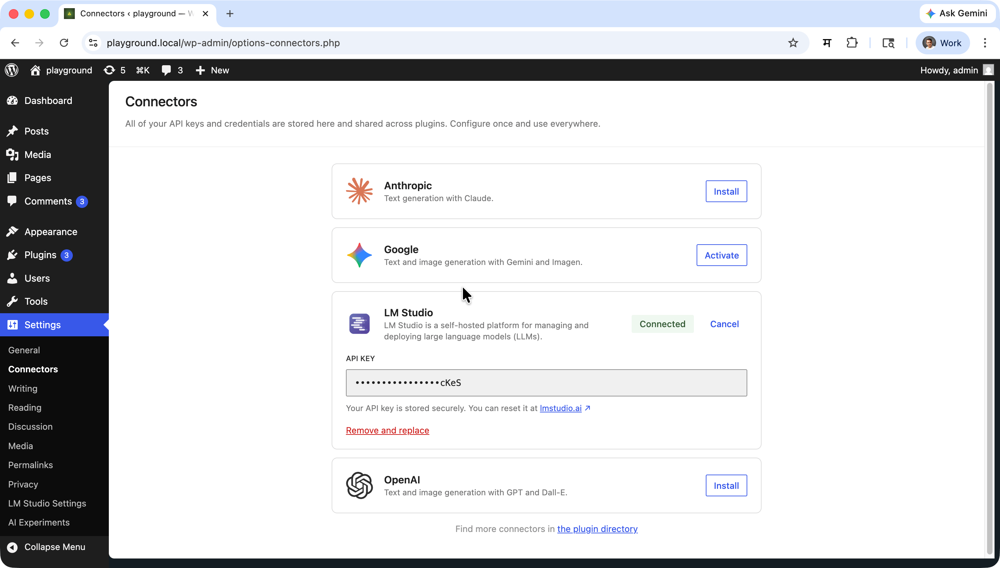
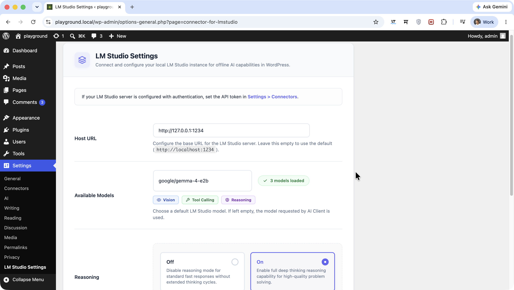
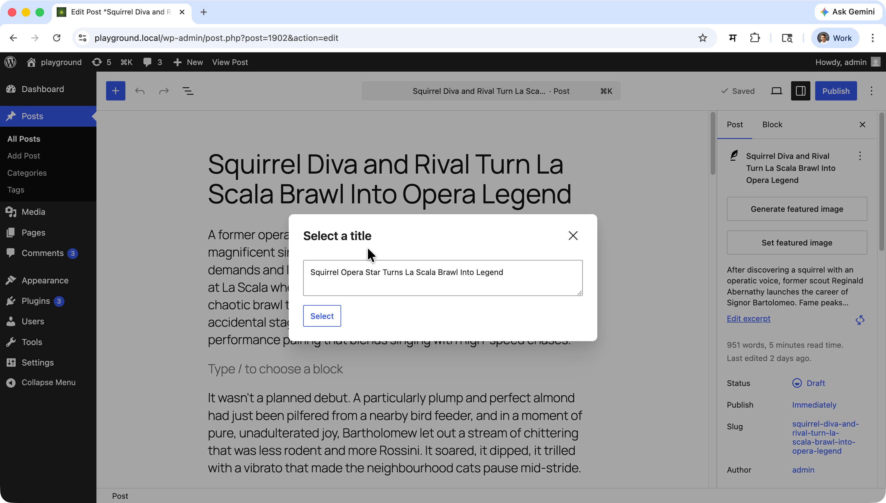
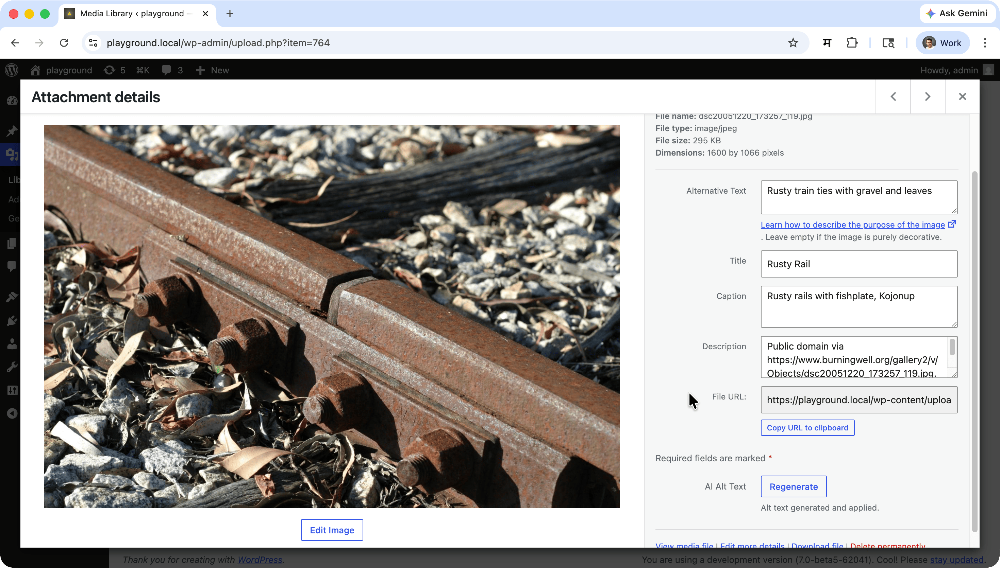

# Connector for LM Studio - Run Local AI Models in WordPress

**Contributors:** [rtCamp](https://profiles.wordpress.org/rtcamp/), [milindmore22](https://profiles.wordpress.org/milindmore22), [vishal4669](https://profiles.wordpress.org/vishal4669/), [aviralmittal89](https://profiles.wordpress.org/aviralmittal89/)

**Tags:** WordPress, AI, LM Studio, Local AI, Text Generation, Vision, Language Models, Self-hosted

This plugin is licensed under the GPL v2 or later.

## Overview

Connector for LM Studio is a WordPress plugin that registers [LM Studio](https://lmstudio.ai/) as an AI provider for the WordPress AI Client. It lets you run AI inference entirely on your own machine — no cloud account or API key required.

## Description

**Connector for LM Studio** bridges the WordPress AI Client with LM Studio's local REST API, allowing you to:

* **Run AI models locally** — no data leaves your machine
* **Generate text** using any LLM loaded in LM Studio
* **Configure a default model** generation from WordPress admin settings
* **Discover available models** automatically from your running LM Studio instance
* **Switch models** without changing any code — just update your admin settings

This makes it simple to integrate powerful, locally-hosted language models into your WordPress site while keeping full control over your data and infrastructure.

## Why Connector for LM Studio?

Many teams need AI features without sending data to external services — for compliance, privacy, or cost reasons. Running models locally with LM Studio solves this but requires gluing together the LM Studio server with WordPress. This plugin handles that integration by:

- **Zero cloud dependency:** All inference happens on the local LM Studio server
- **No API key required:** LM Studio works without authentication by default
- **Standardized interface:** All models exposed through the WordPress AI Client's consistent API
- **Flexible configuration:** Switch models from admin settings — no code changes required
- **Automatic localhost handling:** WordPress HTTP restrictions for local URLs are resolved automatically

### Key Benefits

- **Privacy-first:** Data never leaves your server
- **Cost-free inference:** No per-token charges once the model is downloaded
- **Model freedom:** Load any model supported by LM Studio
- **Vision support:** Use multimodal models for image + text prompts
- **Simple setup:** Point to your LM Studio host and start generating

### API Integration

The plugin communicates with LM Studio's REST API:

| Endpoint | Purpose |
|---|---|
| `GET /api/v1/models` | Populate the model dropdown in settings |
| `POST /api/v1/chat` | Text generation requests |

### Limitations

- Only LLM-type models loaded in LM Studio are supported; embedding-only models are filtered out.
- Image *generation* (text-to-image) is not supported — only image *input* for vision models.
- Only the single model configured in settings is used as the default; per-request model selection is controlled by the AI Client.

## System Requirements

- **WordPress:** 7.0 or higher
- **Requires at least:** 7.0
- **Tested up to:** 7.0
- **Stable tag:** 1.1.0
- **PHP:** 7.4 or higher
- **Requires PHP:** 7.4
- **Required Plugin:** [AI Experiments](https://wordpress.org/plugins/ai/) (`ai`) must be active
- **LM Studio:** Local server must be running and accessible

## Installation & Setup

### As a WordPress Plugin

1. Ensure the **AI Experiments** plugin (`ai`) is installed and activated.
2. Download or clone this plugin into `wp-content/plugins/connector-for-lmstudio`.
3. Activate **Connector for LM Studio** from the Plugins screen.
4. Start LM Studio and load a model.
5. Optionally configure the host URL and default model in **Settings > LM Studio Settings**.

### As a Composer Package

```bash
composer require rtcamp/connector-for-lmstudio
```

## Usage Guide

### Accessing the Settings

Navigate to **Settings > LM Studio Settings** in your WordPress admin to configure Connector for LM Studio.

### Configuring Connector for LM Studio

#### Setting Up Authentication (Optional)

LM Studio does not require authentication by default. If you have configured your LM Studio server to require an API token:



1. Go to **Settings > Connectors**.
2. Enter your LM Studio API token and save.

#### Setting the Host URL

The plugin connects to `http://localhost:1234` by default. If your LM Studio server runs on a different address or port:

1. Navigate to **Settings > LM Studio Settings**.
2. Enter the base URL of your LM Studio server in the **Host URL** field (e.g. `http://192.168.1.10:1234`).
3. Save your settings.



You can also override the host via the `LMSTUDIO_HOST` environment variable — this takes priority over the admin setting.

#### Selecting a Default Model

1. Navigate to **Settings > LM Studio Settings**.
2. The **Available Models** dropdown is populated automatically by querying your running LM Studio instance.
3. Select a model to use as the default for all AI Client requests routed to LM Studio.
4. Leave the field empty to let the AI Client choose the model per request.
5. Save your settings.

### Text Generation

```php
use WordPress\AI_Client\Prompt_Builder;

$result = Prompt_Builder::create()
    ->using_provider( 'lmstudio' )
    ->set_model( 'llama-3.2-3b-instruct' ) // LM Studio model key
    ->set_system_instruction( 'You are a helpful assistant.' )
    ->add_text_message( 'Write a short haiku about sunrise.' )
    ->generate_text();
```

#### WordPress Ability

You can use Connector for LM Studio for any WordPress AI Client feature that supports text generation, such as:



- Title generation
- Excerpt generation
- Content summarization

### Multimodal (Vision) Input

Vision-capable models can accept image inputs alongside text. The plugin detects image parts in the prompt and switches to the multimodal input format automatically:

```php
use WordPress\AI_Client\Prompt_Builder;

$result = Prompt_Builder::create()
    ->using_provider( 'lmstudio' )
    ->set_model( 'llava-v1.6-mistral-7b' ) // Vision-capable model key
    ->add_text_message( 'Describe what you see in this image.' )
    ->add_image_from_url( 'https://example.com/photo.jpg' )
    ->generate_text();
```

#### WordPress Ability
You can use Connector for LM Studio's vision capabilities in any WordPress AI Client feature that supports image input, such as:



- Alt text generation
- Image captioning / analysis

### Environment Overrides

For advanced deployments, override defaults using PHP constants or environment variables:

- `LMSTUDIO_HOST` — Override the LM Studio server base URL (default: `http://localhost:1234`)

## Development & Contributing

Connector for LM Studio is actively developed and maintained by [rtCamp](https://rtcamp.com/).

- **Repository:** [https://github.com/rtcamp/connector-for-lmstudio](https://github.com/rtcamp/connector-for-lmstudio)

We welcome contributions! Please open an issue or pull request on GitHub.

### PHP

```bash
composer run-script lint
composer run-script format
composer run-script phpstan
```

### JavaScript

```bash
npm run lint:js
npm run lint:js:fix
```

### Combined Lint

```bash
npm run lint
```

### Build Release Zip

```bash
npm run plugin-zip
```

This creates `connector-for-lmstudio.zip` in the plugin root, excluding all development-only files.

## Frequently Asked Questions

### What is LM Studio?

[LM Studio](https://lmstudio.ai/) is a desktop application for downloading, managing, and serving large language models locally. It exposes a REST API that this plugin communicates with.

### Do I need an API key?

No. LM Studio does not require authentication by default. If you have enabled authentication on your LM Studio server, you can provide the API token in **Settings > Connectors**.

### Does this plugin require the WordPress AI Client plugin?

Yes. The **WordPress AI** plugin (`ai`) must be installed and activated. This plugin registers Connector for LM Studio as a provider within that framework.

### Does LM Studio need to be running for the plugin to work?

Yes. LM Studio must be running with at least one model loaded for text generation to work. The plugin will show an error if it cannot reach the configured host.

### Can I use vision / image-input models?

Yes. When a model is loaded in LM Studio with vision capabilities, the plugin automatically uses the multimodal input format when image parts are included in a prompt. No additional configuration is needed.

### Can this plugin generate images?

No. LM Studio supports LLM inference only. Text-to-image generation is not available through this plugin.

### Can I change the LM Studio server address?

Yes. Enter the full base URL (including port) in **Settings > LM Studio Settings > Host URL**, or set the `LMSTUDIO_HOST` environment variable. The environment variable takes priority.

### Why does text generation sometimes time out?

Loading or warming up a large model in LM Studio can take a significant amount of time. The plugin automatically extends the HTTP timeout to 180 seconds for all requests to the configured LM Studio host to accommodate this.

### Is multisite supported?

The plugin can be network-activated on multisite. Each site's settings are managed independently via their own **Settings > LM Studio Settings** page.

## Troubleshooting

### No models appearing in the settings dropdown

- Confirm LM Studio is running and a model is loaded.
- Verify the **Host URL** in **Settings > LM Studio Settings** matches your LM Studio server address.
- Check that the **WordPress AI** plugin is active.

### Text generation failing or timing out

- Ensure LM Studio is running and the model has finished loading.
- The plugin extends the timeout to 180 s; if generation still times out, the model may need more time to warm up — try again after LM Studio reports the model as ready.
- Check the PHP error log for detailed error messages.

### Settings not saving

- Check file permissions and database write access.
- Look for conflicting plugins that may be overriding the settings page.

### Common Issues

- **"AI provider not found" error in settings:** The WordPress AI plugin may not be fully initialised — deactivate and reactivate both plugins, then reload the settings page.
- **Connection refused errors:** Confirm LM Studio is running and the host URL (including port) is correct.
- **Authentication errors:** If LM Studio is configured with an API key, make sure it is entered in **Settings > Connectors**.

- **Text generation failing or timing out:** If LM Studio is timing out, turn off the thinking ability for the model from the Model settings in LM Studio.
  
## Support & Community

- **Issues & Bug Reports:** [GitHub Issues](https://github.com/rtcamp/connector-for-lmstudio/issues)
- **Source Code:** [GitHub Repository](https://github.com/rtcamp/connector-for-lmstudio)

## License

This project is licensed under the GPL v2 or later — see the [LICENSE](LICENSE) file for details.

---

**Made with ❤️ by [rtCamp](https://rtcamp.com/)**
